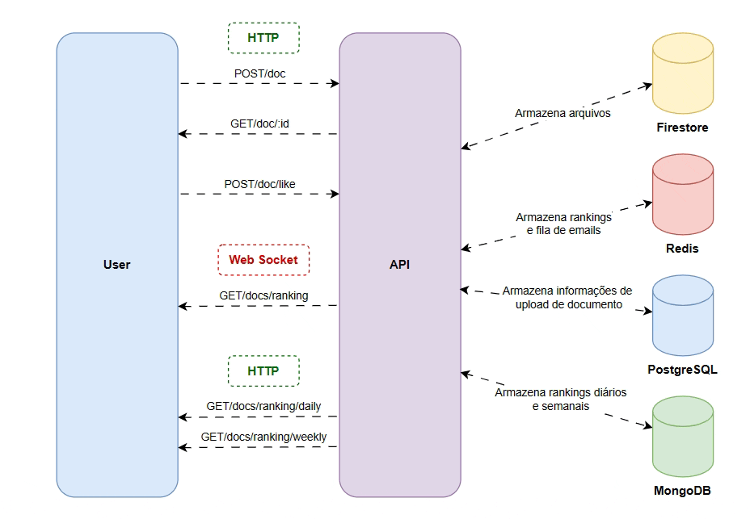

# Lib Catalog API



## About ℹ️

This is an `api` that simulates an api of a fictitious company (_Lib Catalog_) that stores and makes digital documents available.

## About the Problem 🖊️

_Lib Catalog_ is a Digital Document Library Company that processes thousands of documents every day in order to store and make these documents available for multiple users to access. It also has a _metrics system_ that evaluates the number of documents that a user has uploaded and returns this in point format depending on the relevance of the document, number of likes, and size of the document, size in MB - MegaBytes that is later placed in a ranking for all users to view the most relevant documents on a topic. The rankings are separated into real-time rankings, daily rankings and weekly rankings. At the end of each week, an email is sent to users updating the weekly ranking. This company has a problem with having a system to manage this information and make it quickly available to its users.

Suppose that relevance is given by:

```
Relevance = 0.1 * Document Size (MB) + 0.9 * Number of Likes
```

## Technologies Used ⚙️

### Development

* Python
* FastAPI

### Protocols

* HTTP
* Web Socket

### Database

* Firestore
* Redis
* PostgreSQL
* MongoDB

### Requirements (Python)

**Python version: 3.11.9**

```
virtualenv
fastapi
pymongo
redis
google-cloud-firestore
psycopg2
SQLAlchemy
```

Features ✅

[ ] 
[ ]
[ ]
[ ]
[ ]
[ ]
[ ]
[ ]
[ ]


## Running the Project 🏃

### For only use the api

Run the Docker

```shell
docker compose up -d
```

### For improve with new features

1. Install and create a virtual enviroment

```shell
pip install virtualenv
virtualenv .venv
```

_Obs.: Activete the virtual enviroment before the next step_

2. Up docker with only databases

```shell
docker compose up databases -d
```

3. Run the project

```shell
python app.py
```

## Acknowledge ☺️

A thank you to Alpha EdTech, because through it I was able to present this project for the Academic Moment in 2024.

License 📖

This project is open-source and is distributed under the MIT License. Feel free to explore, modify, and utilize the codebase according to the terms outlined in the license.